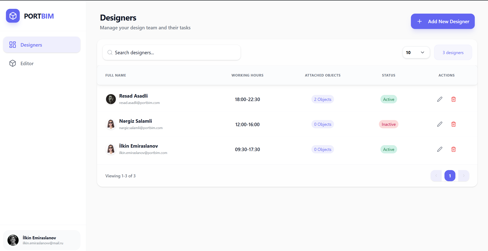
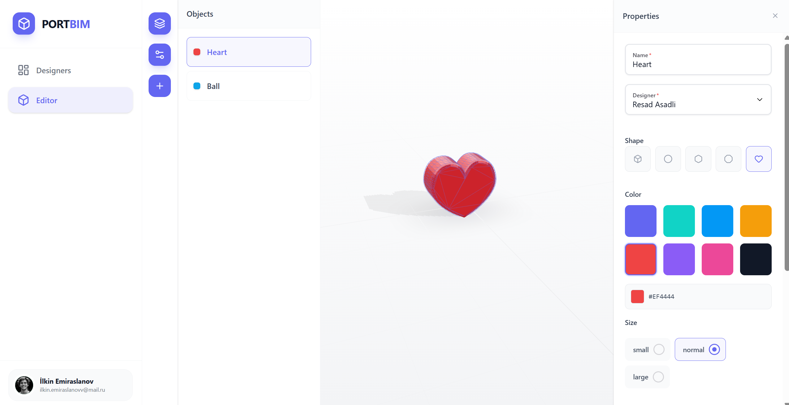
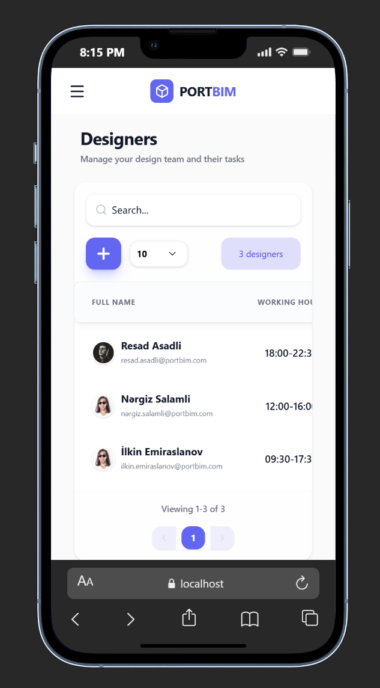
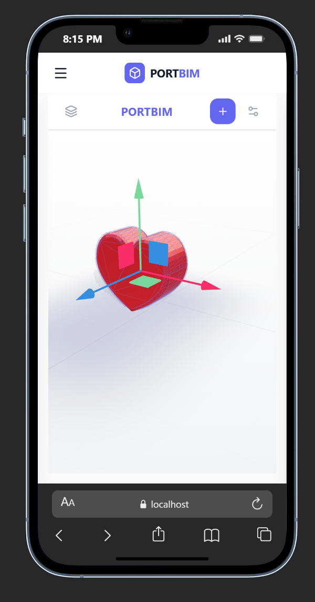

# PortBIM 3D Environment

PortBIM is a specialized 3D editor and management dashboard designed for creating and linking geospatial elements with personnel data in a unified interface. It features a robust **Designer Management** system integrated with an interactive **3D Scene Editor**.

## Screenshots

  
  <!-- 1-ci row: 2 şəkil yan-yana -->
  
  

  <!-- 2-ci row: sağ tərəfdə alt-alta 2 şəkil -->
  

    
    
  

## Key Features

### Designer Management
The application provides full control over the team of designers, allowing administrators to:
- **Create & Manage Profiles**: Add new designers with detailed information including working hours.
- **Status Control**: Toggle designers between *Active* and *Inactive* status. Inactive designers are automatically filtered out from new assignments.
- **Update & Delete**: Edit existing records or remove designers when no longer needed.
- **Data Persistence**: All designer data is securely stored and managed via **Appwrite**.

### 3D Interactive Editor
A powerful WebGL-based editor that allows users to construct 3D scenes directly in the browser:
- **Object Creation**: Add geometric primitives (Box, Sphere, Cylinder, Torus) and custom shapes (Extruded Heart) to the scene.
- **Manipulation**: Select, move, and modify properties of 3D objects in real-time.
- **Smart Assignment**: Link 3D objects to specific designers. The system intelligently filters the assignment list to show only **Active** designers, preventing errors.
- **Visual Feedback**: Real-time rendering with shadows, environment lighting, and interactive controls.

## Technology Stack

The project is built on a modern, type-safe stack designed for performance and scalability:

- **Frontend Core**: [React](https://react.dev/), [TypeScript](https://www.typescriptlang.org/), [Vite](https://vitejs.dev/)
- **3D Engine**: [React Three Fiber](https://docs.pmnd.rs/react-three-fiber), [Drei](https://github.com/pmndrs/drei), [Three.js](https://threejs.org/)
- **UI Framework**: [HeroUI](https://www.heroui.com/) (NextUI), [Tailwind CSS](https://tailwindcss.com/)
- **State Management**: [Zustand](https://github.com/pmndrs/zustand), [React Query](https://tanstack.com/query/latest)
- **Backend / Database**: [Appwrite](https://appwrite.io/)
- **Forms & Validation**: [React Hook Form](https://react-hook-form.com/), [Zod](https://zod.dev/)

## Architecture

The codebase follows **Clean Architecture** principles to ensure maintainability:
- **Core Layer**: Contains domain entities and business logic interfaces.
- **Infrastructure Layer**: Implements repositories (e.g., Appwrite integration) and external services.
- **Features Layer**: Encapsulates UI components and logic specific to modules (Editor, Designers).
